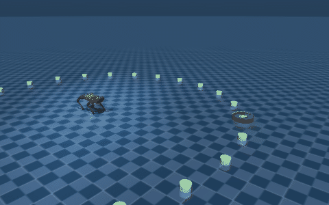

# Walking Dog

**A Unitree A1 quadruped learns to walk to a goal — with two PPO policies that
learn at the same time: one that decides where to go, one that figures out how
to move the legs to get there.**

Written from scratch in MuJoCo with PyTorch. No `gym`, no `stable-baselines3` —
the PPO update, GAE, and the reward shaping are all in this repo, because
writing them was the point.



*The green disc is the goal, sampled anywhere on the 3 m ring. The robot starts
at the centre facing +X, so most episodes begin by turning.*

---

## Results

<!-- RESULTS_TABLE -->

Reproduce any row:

```bash
python evaluate.py --episodes 200 --seed 0
```

## The idea: split "where to go" from "how to walk"

A single policy mapping goal position to 12 joint torques has to solve two
unrelated problems at once — long-horizon navigation and 500 Hz balance. They
want different inputs and different reward horizons, and mixing them made the
robot learn to shuffle toward the goal without ever developing a gait.

So there are two policies, trained jointly, connected by a 2-number command:

```
      goal position                     body state
     (dx, dy, distance,               (orientation, angular
      heading error)                   velocity, 12 joint
            │                          angles + velocities,
            ▼                          trunk height)
    ┌────────────────┐                       │
    │   nav policy   │                       │
    │   15D  →  2D   │                       │
    │  MLP 128 wide  │                       │
    └───────┬────────┘                       │
            │                                │
            │  [forward, turn]  ─────────────┤
            │   the only channel             │
            │   between them                 ▼
            │                        ┌────────────────┐
            └───────────────────────►│  walk policy   │
                                     │   34D  →  12D  │
                                     │  MLP 256 wide  │
                                     └───────┬────────┘
                                             │ joint offsets
                                             ▼
                              ctrl = HOME_POSE + 0.25 × action
                                             │
                                             ▼
                                      MuJoCo, 500 Hz
```

**The nav policy never sees a joint angle.** It reads goal geometry and body
pose and emits `[forward, turn]`. Its reward is about position: face the goal,
close on it, don't circle it.

**The walk policy never sees the goal.** It reads the body state plus that
2-number command, and emits 12 joint offsets. Its reward is about gait quality:
hold a trot, stay level, obey the command it was given.

Because only the walk policy touches the actuators, the nav policy is graded on
where the robot actually ends up — it has to learn commands the walk policy can
actually execute. And because the walk policy is told *what to do* rather than
*where the goal is*, it stays a general gait controller rather than becoming a
second navigator.

Both learn simultaneously, which is the interesting part and also the risky
part: each policy's environment is non-stationary, since the other one keeps
changing underneath it. See [Known issues](#known-issues-and-what-id-fix-next).

### Actions are offsets from a standing pose

The policy output is not a joint angle — it is a *deviation* from a fixed
crouch (`HOME_CTRL`), scaled by 0.25 rad:

```python
ctrl = HOME_CTRL + action * ACTION_SCALE
```

Combined with a near-zero-initialised output layer, this means an untrained
policy stands still instead of flailing. The robot doesn't have to learn "don't
fall over" before it can start learning "walk" — it starts from standing and
learns the deviation.

## Quickstart

```bash
git clone https://github.com/cmkoenig01/Walking-Dog.git
cd Walking-Dog
python -m venv .venv && source .venv/bin/activate
pip install -r requirements.txt
```

Watch the trained policies (no training required — the checkpoints are in the
repo):

```bash
python watch.py
```

> **macOS:** the MuJoCo viewer must own the main thread, so use
> `mjpython watch.py`. `mjpython` ships with the `mujoco` wheel. `watch.py`
> checks for this and tells you rather than failing deep in the stack.

Benchmark them headlessly — much faster than real time, and this is what
produced the results table:

```bash
python evaluate.py --episodes 200 --seed 0
```

Train from scratch:

```bash
python train.py --steps 5_000_000
```

Ctrl-C saves and exits cleanly. Training writes checkpoints and a CSV of
learning curves into `runs/<name>/`, and **never** overwrites the shipped
policies in `checkpoints/` — promoting a run is a deliberate copy:

```bash
cp runs/latest/walk_best.pt checkpoints/walk_best.pt
```

To continue training the shipped policies instead of starting over:

```bash
python train.py --init best --steps 1_000_000
```

## Observation and action spaces

Both layouts are frozen: they are a contract with the saved checkpoints, and
`tests/test_env.py` asserts them so a careless edit fails loudly instead of
silently producing a garbage policy.

**Nav policy — 15D observation → 2D action**

| Slice | Size | Contents |
|------:|-----:|----------|
| `0:4`   | 4 | Trunk orientation quaternion |
| `4:7`   | 3 | Trunk angular velocity |
| `7:8`   | 1 | Trunk height |
| `8:10`  | 2 | Goal offset (dx, dy), normalised by 6 m |
| `10:11` | 1 | Distance to goal, normalised |
| `11:13` | 2 | Heading error as (cos, sin) |
| `13:15` | 2 | Robot yaw as (cos, sin) |

Output: `[forward, turn]`. The policy *mean* is Tanh-bounded to [-1, 1], which
is what `evaluate.py` and `watch.py` execute. During training the command is a
Gaussian sample around that mean and is **not** re-bounded — see
[Known issues](#known-issues-and-what-id-fix-next).

Angles are fed as (cos, sin) pairs rather than raw radians so the network never
sees the discontinuity at ±π, where 179° and -179° are adjacent in the world
but maximally far apart numerically.

**Walk policy — 34D observation → 12D action**

| Slice | Size | Contents |
|------:|-----:|----------|
| `0:4`   | 4  | Trunk orientation quaternion |
| `4:7`   | 3  | Trunk angular velocity |
| `7:19`  | 12 | Joint positions |
| `19:31` | 12 | Joint velocities |
| `31:32` | 1  | Trunk height |
| `32:34` | 2  | Nav command |

Output: 12 joint offsets, one per actuator, in leg order FR, FL, RR, RL and
within each leg hip, thigh, calf.

**Episode ends** when the trunk tips past ~60° or drops below 15 cm (a fall),
when the robot holds the goal for 100 steps (a success), or at 7500 steps.

## Reward design

Both reward functions are dense and hand-tuned. The full code is in
[`a1_env.py`](a1_env.py); the reasoning:

**Nav reward** is built around a single insight: *turning and moving are
different modes and should be rewarded differently.* Above a heading-alignment
threshold of 0.7 (~45°), forward speed toward the goal pays well and turning is
only gently encouraged. Below it, turning pays 3.5× more and forward motion is
capped at a crawl and penalised beyond it.

The failure mode this exists to kill: a robot that runs fast in roughly the
right direction and then orbits the goal forever, never converging. That is
also why being *close but misaligned* carries the single largest penalty in the
function — it is precisely the orbiting state.

**Walk reward** is a gait-quality score. The positive terms pay for a trot
(diagonal pairs in phase — FR+RL, then FL+RR), foot clearance during swing,
staying level, and matching the commanded forward and turn rates. The penalties
suppress the specific ways a quadruped cheats: hopping (both front feet
together), dragging (all four feet planted), lateral drift, backward motion,
body tilt and roll rate, jerky actions, and yaw the command didn't ask for.

The heaviest single penalty is on lateral velocity, quadratic — early policies
loved to crab sideways toward the goal, which technically closes distance while
looking nothing like walking.

## Repository map

| File | What it is |
|------|------------|
| [`a1_env.py`](a1_env.py) | **The task.** Observation layout, reward functions, termination, goal sampling. One definition, imported by everything else. |
| [`ppo.py`](ppo.py) | PPO: clipped surrogate objective, GAE, clipped value loss, learnable action std. |
| [`networks.py`](networks.py) | Actor and critic MLPs. |
| [`train.py`](train.py) | Training loop — 16 parallel environments, both policies updated jointly. |
| [`evaluate.py`](evaluate.py) | Headless benchmark. Produces the results table. |
| [`watch.py`](watch.py) | Interactive MuJoCo viewer. |
| [`record.py`](record.py) | Renders an episode to a GIF (needs `pillow`). |
| [`tests/test_env.py`](tests/test_env.py) | Pins the observation contract, reward finiteness, GAE, checkpoint round-trip. |
| `checkpoints/` | The trained policies this README reports on. |
| `unitree_a1/` | Robot model — third party, see [THIRD_PARTY.md](THIRD_PARTY.md). |

## Training setup

| | |
|---|---|
| Algorithm | PPO, clipped surrogate, separate actor and critic optimisers |
| Parallel environments | 16 |
| Rollout per update | 2048 steps per environment (32,768 transitions) |
| Optimiser | Adam, lr 3e-4, grad-norm clip 0.5 |
| Discount / GAE λ | 0.99 / 0.95 |
| Clip ε | 0.2 |
| Epochs per update | 4, minibatch 512 |
| Entropy coefficient | 0.02 |
| Control rate | 500 Hz (MuJoCo timestep 2 ms) |
| Exploration | Learnable per-dimension log-std, init ≈ 0.37 |

## Known issues, and what I'd fix next

I audited this code after the fact. These are real defects I found and chose
*not* to silently patch, because fixing any of them changes the objective the
shipped checkpoints were trained against, and the numbers above would no longer
describe the policies in this repo. Each is a genuine next step, not a
disclaimer.

**Time-limit truncation is treated as termination.** `train.py` marks an
episode `done` when it hits the 7500-step cap, and `_gae` then zeroes the
bootstrap. The value function is told the world ends at the time limit, which
biases every value target near the cap. The fix is to carry `terminated` and
`truncated` separately and bootstrap `V(s_final)` on truncation.

**The exploration std is pinned at its ceiling.** `log_std` is clamped with
`.clamp(0.01, 0.5)` *inside* the graph, so once it reaches the upper bound the
gradient through it is zero and it can never come back down. The policy cannot
anneal its own exploration. The fix is to clamp the parameter out-of-band after
the optimiser step.

**The uprightness term is yaw-dependent.** The walk reward uses
`0.3 * qpos[3]` — the quaternion `w` component — as an "upright" bonus. But `w`
encodes total rotation including yaw, so it pays the robot to face world +X and
decays as it turns away. `_is_fallen` already computes the correct yaw-free
form (`1 - 2(qx² + qy²)`) three functions earlier. It is a small term relative
to the ±6.0 turn-following reward, so it is a bias rather than a disaster, but
it is wrong.

**Foot sensing uses the calf body, not the foot.** Contacts and swing clearance
are keyed to the calf *body* origin, which sits ~12 cm above the actual foot,
so "clearance" is measured at the wrong point and a shin scrape counts as a
foot contact.

**Gait terms score a static snapshot.** `trot_active` checks the instantaneous
contact pattern, so a robot that holds one diagonal pair in the air and shakes
scores as trotting. Rewarding the *alternation* over time, rather than the
pattern in a single frame, is the right formulation.

**Entropy is averaged, not summed.** `dist.entropy().mean()` averages over
action dimensions while `log_prob` sums over them, so the effective entropy
coefficient is 12× weaker for the walk policy than for the nav policy — an
accident, not a decision.

**The nav command is unbounded during training.** The actor's Tanh bounds the
*mean* to [-1, 1], but training executes a Gaussian sample around it, so the
`[forward, turn]` command the walk policy actually receives can land outside
[-1, 1] — and it is multiplied into the walk reward. Evaluation uses the mean,
so the deployed command is bounded and the training/evaluation distributions
differ slightly. Clipping the sample once, before it is both stored and
executed, is the fix.

**Beyond the bugs:** the 34.5% timeout rate is the headline weakness, and it is
concentrated in goals that require a large initial turn. Domain randomisation
(the robot always starts from the identical keyframe at yaw 0), a proper
train/test split of goal angles, and a learning-rate schedule are the obvious
next moves.

## Credits

The robot model in `unitree_a1/` is the Unitree A1 description from
[MuJoCo Menagerie](https://github.com/google-deepmind/mujoco_menagerie),
© Unitree Robotics, BSD-3-Clause. `scene.xml` is modified to add the goal ring
and marker — details in [THIRD_PARTY.md](THIRD_PARTY.md).

Everything else is mine, MIT licensed — see [LICENSE](LICENSE).
